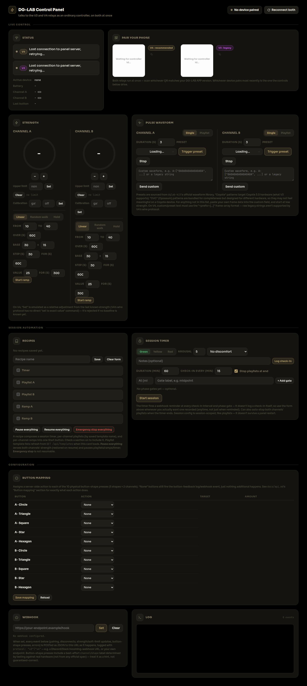
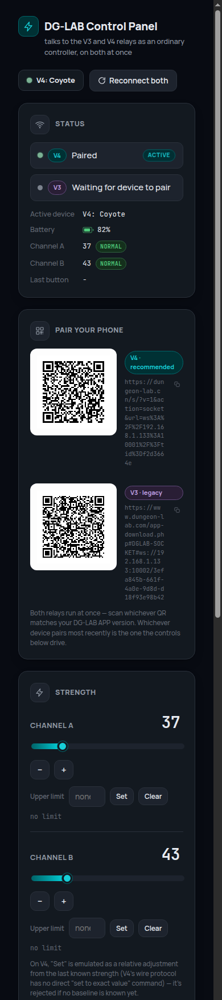

# DG-LAB WebSocket Server (Rust)

A Rust port of [dglab-websocket-server](https://github.com/dungeonlab-open/dglab-websocket-server), the WebSocket relay server for the [DGLAB KIT](https://github.com/dungeonlab-open/dglab-kit/) — providing the same relay between third-party control clients and the DG-LAB APP that the original TypeScript/Bun implementation (`v3-server.ts` / `v4-server.ts`) provides, with matching message shapes, error/close codes, and env var names. See [`NOTICE.md`](NOTICE.md) for upstream attribution.

It implements both DG-LAB protocols, plus a control panel webserver, in a single binary as three independent servers with no shared in-process state:

| Server | Default port | What it is |
| --- | --- | --- |
| V4 relay | `10001` | 1 controller : N devices, recommended protocol |
| V3 relay | `10002` | 1 controller : 1 device, legacy protocol |
| Control panel | `40000` | A webpage: QR pairing, strength/waveform controls, live status and log |

The default relay ports are intentionally offset **+3** from the reference server's `9998`/`9999`, so both implementations can run side-by-side on the same machine without a port clash.

The control panel is a real client of both protocols, not a special-cased shortcut: it connects to the V3 and V4 relays over ordinary loopback WebSocket, simultaneously, exactly like any third-party controller would, so pairing/strength/waveform all go through the same code path a real controller uses on whichever protocol the device is actually using.

For a deeper dive — architecture diagrams, full API reference, sequence diagrams, and a usage guide for integrating your own controller — see [`docs/`](docs/README.md).

## Safety and medical disclaimer

**This software is not a medical device and is not intended for any medical, therapeutic, or clinical use.** It is unofficial, community-built control software for a consumer electrical-stimulation ("e-stim") device. It was written independently of DG-LAB / Dungeon Lab and has not been reviewed, certified, or endorsed by them for safety.

This software sends real strength-adjustment and waveform commands to a physical device capable of delivering electrical stimulation to a person's body. A bug in this software (or in a modification you make to it), a problem in the network path between this server and the DG-LAB APP, or a fault in the device itself, could cause stimulation to start, stop, increase, or continue unexpectedly.

- **Do not use this software, or DG-LAB devices in general, if you:** have a cardiac pacemaker, an implanted defibrillator, or any other implanted electronic medical device; have a heart condition or arrhythmia; are pregnant; have epilepsy or a seizure disorder; or have been advised by a medical professional against using electrical stimulation devices.
- **Never place electrodes/pads on or near the head, neck, throat, chest (across the heart), or spine.**
- **Never use unattended**, while operating a vehicle or machinery, while impaired, or in any situation where a sudden or unexpected muscle response could cause injury.
- **Always start at the lowest strength setting** and increase gradually. Stop immediately if you experience pain, burning, skin irritation, or any adverse reaction.
- This software includes an application-level "upper limit" safety cap (see [Control panel](#control-panel) below), but it is a convenience, not a certified safety mechanism — it depends on the device's own status reports arriving correctly, is not a substitute for supervision and good judgment, and can be bypassed by a bug, a race condition, a modification, or a device/relay failure.
- Pasted or custom pulse waveform data (see "On the pulse waveform presets" below) is sent to the device largely opaque to this software — using data you haven't verified is safe for you carries the same risk as any unverified electrical stimulation pattern.

**No warranty. Use entirely at your own risk.** As stated in the GPLv3 license this project is distributed under (see [`LICENSE`](LICENSE)), this software is provided "AS IS", WITHOUT WARRANTY OF ANY KIND, express or implied. The authors and contributors of this port accept no liability for any injury, harm, or damage arising from its use. This disclaimer was written for this Rust port specifically — no upstream disclaimer of this kind exists to translate or import; see [`NOTICE.md`](NOTICE.md) for what upstream does provide (a non-commercial-use notice) and full attribution.

## Requirements

- Rust 1.97+ (uses `edition = "2024"`)

## Running

```bash
cargo run
```

This starts all three servers concurrently:

```text
ws://0.0.0.0:10001    # V4 relay
ws://0.0.0.0:10002    # V3 relay
http://0.0.0.0:40000  # control panel
```

If any port fails to bind, the process exits with an error rather than silently running with only some servers available. Open `http://<this machine's LAN IP>:40000/` from a phone or laptop on the same network to use the control panel.

## Testing

```bash
cargo test              # unit tests (pure parsing/pulse logic, state-machine behavior) + integration tests
cargo clippy --all-targets
cargo doc --no-deps --open   # browse the generated API docs
```

Integration tests (`tests/v3_integration.rs`, `tests/v4_integration.rs`) spin up a real server on an ephemeral port and drive it with a `tokio-tungstenite` client, covering each protocol's connect/pair/message/disconnect happy path plus one failure path. `tests/panel_v4_integration.rs` drives the panel's V4 leg the same way end-to-end: a simulated APP attaches, reports a device, and the panel's HTTP API is used to confirm real `device.op`/`device.op.clear` wire frames arrive with the exact expected shape. `tests/panel_webhook_integration.rs` does the same for the webhook feature over V3. `tests/panel_ramp_integration.rs` and `tests/panel_playlist_integration.rs` do the same for the ramp and playlist runner tasks — proof that those background tasks actually drive their schedules/queues over the wire, not just that the HTTP calls are accepted. The control panel's unit tests cover the dual-protocol state machine (`src/panel/state.rs`), V3 and V4 frame construction (`commands.rs`, `v4_commands.rs`), device status/button-feedback parsing on both protocols (`relay_client.rs`, `v4_client.rs`), QR/URL building for both (`qrcode.rs`), calibration math (`calibration.rs`), ramp/session-timer scheduling (`ramp.rs`, `session.rs`), and playlist/template/recipe/button-map persistence and validation, plus a round-trip check that every bundled preset parses correctly through the same pulse-waveform code the V3 relay itself uses (`src/panel/presets.rs`).

## Configuration

Environment variables, read at startup:

| Variable | Protocol | Default | Description |
| --- | --- | --- | --- |
| `PORT` | both | V4: `10001` / V3: `10002` | Listen port (each protocol reads the same var name — see note below) |
| `HEARTBEAT_INTERVAL` | both | V4: `30000` / V3: `60000` | Heartbeat broadcast interval, ms |
| `IDLE_TIMEOUT` | both | `300000` | V3: how long an unpaired connection may sit idle. V4: how long a controller may have zero attached devices |
| `WS_PING_INTERVAL` | V4 | `10000` | Native WS ping interval, ms |
| `MAX_MISSED_WS_PONGS` | V4 | `3` | Consecutive missed pongs before a connection is terminated |
| `PREFIX` | V4 | `/` | The sole upgrade-eligible path, e.g. `/v4` or `/relay/v4` |
| `DEFAULT_PUNISHMENT_TIME` | V3 | `1` | Pulse packets sent per second, clamped to `[1, 10]` |
| `DEFAULT_PUNISHMENT_DURATION` | V3 | `5` | Fallback waveform duration (s) when a `clientMsg` frame omits `time` |
| `LOG_LEVEL` | both | `info` | `debug` / `info` / `warn` / `error` |
| `VERBOSE` | both | `false` | `true` forces `debug` logging |
| `LOG_DIR` | both | `logs` | Directory for the self-managed rotating log file (every line is also still printed to stdout) |
| `LOG_MAX_TOTAL_BYTES` | both | `524288000` (500 MiB) | Total on-disk budget across the active log file and its 9 backups |
| `PANEL_PORT` | panel | `40000` | Control panel listen port |
| `PANEL_PUBLIC_WS_BASE` | panel | unset | Overrides the pairing QR's `scheme://host` (e.g. `wss://relay.example.com`) for a reverse-proxy/TLS deployment. When unset, it's derived per-request from the browser's own `Host` header (falling back to the machine's autodetected LAN IP if that header is a loopback address) — see below |
| `PANEL_WEBHOOK_URL` | panel | unset | Initial outbound webhook URL (see below); can also be set/changed/cleared at runtime from the panel page or via `POST /api/webhook` |
| `PANEL_DATA_DIR` | panel | `panel-data` | Directory for the panel's persisted JSON stores: `templates.json`, `recipes.json`, `button-map.json`, `calibration.json` (session timer/ramp/playlist state is in-memory only and does not survive a restart) |

> **Note:** because both relay protocols run in one process, `PORT`/`HEARTBEAT_INTERVAL`/`IDLE_TIMEOUT`/`LOG_LEVEL`/`VERBOSE` are shared variable names — each protocol falls back to its own default when unset, but setting one of these explicitly affects both servers. If you need to override just one protocol's port, run this binary once per protocol with different environment, or edit the defaults in [`src/v3/config.rs`](src/v3/config.rs) / [`src/v4/config.rs`](src/v4/config.rs). Setting `PORT` explicitly makes V3 and V4 collide on the same port — the process refuses to start and prints an explicit error naming the conflict, rather than one relay silently failing to bind and taking the whole process down with it.

**Logging:** every line is printed to stdout and also written to a self-managed, size-capped rotating log file (via [`flexi_logger`](https://docs.rs/flexi_logger)) — the process previously only ever wrote to stdout, leaving disk usage entirely up to however that output happened to be captured (shell redirect, systemd, docker...), with no bound at all. Now it self-manages under `LOG_DIR` (10 files: the active one plus 9 numbered backups, e.g. `server_rCURRENT.log`, `server_r00000.log`, ...), rotating on size so the total never exceeds `LOG_MAX_TOTAL_BYTES` (default 500 MiB).

## Control panel



<details>
<summary>Mobile view</summary>



</details>

`http://<host>:40000/` shows:

- **Two pairing QR codes**, side by side — one for V4 (recommended) and one for V3 (legacy) — each generated from the panel's own controller id on that protocol. Scanning either (or opening the plain link shown under it) connects the phone to that relay, pre-paired with the panel. The panel runs both relay connections at once, so it works with either DG-LAB APP version without you needing to know which protocol it speaks.
- **Shared strength/pulse/clear controls** for channels A and B, driven by whichever protocol's device is currently paired — see "Which device is active" below. Disabled (greyed out) until a device is paired on either protocol.
- Strength controls: increase/decrease/set-exact/clear, each with an optional **upper limit**.
- A **pulse waveform** trigger: a preset picker (grouped by device family) plus a custom-waveform text field.
- **Live status** for both protocols independently (connecting / waiting for device / paired / disconnected, with a badge marking which one is currently active), the active device's current strength and soft limit where available, the most recent physical/on-screen button press, and a scrolling **connection log**.
- A **Reconnect both** button to force fresh controller ids/QRs on demand.

The panel is just another controller on each protocol — it connects to the local V3 and V4 relays over loopback WebSocket (`ws://127.0.0.1:<v3 port>` and `ws://127.0.0.1:<v4 port><prefix>`) the same way a real third-party controller would, so each leg independently reconnects and gets a brand-new controller id (and thus a new QR) any time that connection drops, including whenever its paired device disconnects.

**Which device is active:** the panel tracks V3 and V4 pairing independently and simultaneously, but only one drives the shared strength/pulse controls at a time — whichever protocol's device paired most recently. If that device disconnects, the other protocol's device (if still paired) takes over automatically; if neither is paired, the controls disable. This is a deliberate simplification for the common case (one phone, one protocol, at a time) rather than merging two devices' state — see `src/panel/state.rs`'s module docs for the exact rules.

**Upper limit:** neither protocol has a command to remotely set the device's own configured strength limit — that's a physical/app-side setting, reported to the panel read-only (V3: the "soft limit" alongside current strength; V4 doesn't expose a single equivalent field, so this stays blank on that protocol). What the panel offers instead is an *application-level* safety cap: set an upper limit per channel, and the panel itself refuses (`400`) any Set/Inc that would push that channel above it — Dec is never blocked. Enforcement uses the best currently-known strength for that channel (the device's own status reports, updated optimistically by the panel's own commands in between reports so rapid clicks stay checked); if no baseline is known yet (e.g. right after pairing, before any status report), a Set is still checked against the limit but an Inc is allowed through since there's nothing to compare against. The limit is a panel setting, not device state, so it survives the panel's own reconnects. On V4, "Set" itself is emulated as a relative adjustment from the last known strength (V4's wire protocol only supports relative changes or resetting to `0`, never an arbitrary absolute value) — it's rejected with `409` if no baseline is known yet.

**Pairing over WiFi:** the QR must encode an address your phone can actually reach — not `127.0.0.1` or `localhost`, which the phone would resolve to itself. The panel handles this automatically: the address it embeds is normally read off the `Host` header of whichever request loaded the page, so opening `http://<this machine's LAN IP>:40000/` from any device just works. If you instead open the panel via `http://localhost:40000` (e.g. checking it from the same machine the server runs on), it falls back to this machine's LAN IP, autodetected at startup via outbound route selection (logged at startup as `detected LAN IP ...`) — no packets are sent, it just asks the OS which interface it would use to reach the internet. On a multi-homed machine (VPN, multiple NICs) this heuristic can occasionally pick the wrong interface; if so, set `PANEL_PUBLIC_WS_BASE=ws://<the-right-ip>` to force it. Both QR schemes are confirmed working against a real DG-LAB APP.

**On the pulse waveform presets:** the 44 bundled presets (24 "Coyote", 20 "OVC") are the official waveform library from [`dglab-kit`](https://github.com/dungeonlab-open/dglab-kit) (its `COYOTE_WAVEFORMS`/`OVC_WAVEFORMS`), not placeholder data — each frame was cross-verified byte-for-byte against the upstream source before being committed here (see `src/panel/presets.rs`). "Coyote" targets Coyote 3.0 hardware; "OVC" (Opossum) patterns are bundled for completeness but designed for different hardware and may not feel meaningful on a Coyote device. For anything not in this list, paste your own frame data into the custom waveform field — on V4 it must be in the `"<prefix>:[...]"` frame-array format (no raw-legacy-string fallback, unlike V3).

### HTTP API

`http://<host>:40000` also exposes the JSON API driving the page above, with
no authentication — intended for trusted-network/localhost use, and usable
directly by your own scripts/automation instead of the bundled UI. Full
request/response shapes, status codes, and behavioral notes for every one of
these are in [`docs/api.md`](docs/api.md#control-panel-http).

| Method | Path | Purpose |
| --- | --- | --- |
| `GET` | `/events` | Server-Sent Events stream of the panel's live state (pairing, strength, playlists, ramps, session timer, calibration, ...) |
| `GET` | `/api/presets` | The bundled pulse-waveform preset catalog |
| `GET` | `/api/qr/{v3\|v4}` | The pairing QR for one protocol, on demand |
| `POST` | `/api/strength` | Increase / decrease / set a channel's strength |
| `POST` | `/api/clear` | Clear a channel (cancels any in-flight pulse) |
| `POST` | `/api/pulse` | Send a pulse waveform |
| `POST` | `/api/limit` | Set/clear a channel's operator upper limit |
| `GET`/`POST` | `/api/calibration` | Read/set per-channel intensity calibration (gain/offset) |
| `POST` | `/api/ramp` | Start (or replace) a strength ramp on a channel (linear / random-walk / hold) |
| `POST` | `/api/ramp/stop` | Stop a channel's active ramp |
| `POST` | `/api/session/timer` | Configure and start the session timer (check-ins, phase gates) |
| `POST` | `/api/session/timer/pause` \| `/play` | Pause / resume the session timer |
| `POST` | `/api/session/end` | End the session timer early |
| `POST` | `/api/session/checkin` | Log a subjective check-in (color/arousal/discomfort/notes) |
| `POST` | `/api/session/log-config` | Configure the file-based JSONL event log |
| `POST` | `/api/session/start` | Force a fresh event-log session file |
| `POST` | `/api/session/stop` | Emergency stop: clear both channels, stop playlists/ramps/timer |
| `POST` | `/api/session/pause` \| `/resume` | Pause/resume everything: zero both channels, pause/resume playlists/ramps/timer |
| `GET` | `/api/session/recipes` | List saved recipe names |
| `GET`/`POST`/`DELETE` | `/api/session/recipes/{name}` | Get / save / remove one recipe |
| `POST` | `/api/session/recipes/{name}/start` | Start every piece a recipe defines (timer + ramps + playlists) |
| `GET`/`POST` | `/api/button-map` | Read/replace the physical-button-press → action mapping |
| `POST` | `/api/webhook` | Set/clear the outbound webhook URL |
| `POST` | `/api/reconnect` | Force a fresh relay connection (new controller id/QR) on both protocols |
| `POST` | `/api/playlist/{channel}/items` | Add a pulse or gap entry to that channel's playlist |
| `DELETE` | `/api/playlist/{channel}/items/{id}` | Remove one playlist entry |
| `POST` | `/api/playlist/{channel}/reorder` | Reorder playlist entries |
| `POST` | `/api/playlist/{channel}/settings` | Set shuffle / loop-playback |
| `POST` | `/api/playlist/{channel}/play` \| `/pause` \| `/stop` | Control playlist playback |
| `POST` | `/api/playlist/{channel}/load-template` | Replace a channel's queue with a saved template |
| `GET` | `/api/templates` | List saved playlist template names |
| `GET`/`POST`/`DELETE` | `/api/templates/{name}` | Get / save / remove one template |

### Webhook

The panel can fire an outbound HTTP `POST` to a URL of your choosing every time something happens — the same events that show up in the connection log. Set it from the page's Webhook card, via `PANEL_WEBHOOK_URL` at startup, or with `POST /api/webhook {"url": "https://..."}` (an empty/omitted `url` clears it). Delivery is fire-and-forget with a 5s timeout; failures are only logged to the server's own stdout (never back into the panel's log or as another webhook call), so a broken endpoint can't create a notification loop.

Every payload has at least:

```json
{ "message": "human-readable log line", "timestamp": "2026-08-22T12:34:56.789Z" }
```

Classifiable events add an `event` field plus type-specific fields:

| `event` | Extra fields | Fires when |
| --- | --- | --- |
| `controller_connected` | `controllerId` | The panel (re)connects to the V3 relay and gets a new controller id |
| `paired` | `deviceId` | A device pairs with the panel |
| `bind_failed` | `code` | V3 rejects a pairing attempt |
| `device_disconnected` | — | The paired device disconnects |
| `error` | `code` | V3 reports a protocol error |
| `button_feedback` | `code`, `channel` (`"A"`/`"B"`), `shape` (`"circle"`/`"triangle"`/`"square"`/`"star"`/`"hexagon"`) | A physical shape button is tapped on the device's APP screen (`feedback-<n>`, `n` 0-9). **The channel/shape mapping is not from any official spec** — it was determined empirically against real hardware (tapping both rows of 5 icons left-to-right produced ascending codes 0-4 then 5-9); treat it as best-effort |
| `device_status` | `strengthA`, `strengthB`, `softLimitA`, `softLimitB` | The device reports its current strength/soft-limit state (`strength-<a>+<b>+<softLimitA>+<softLimitB>`) |
| `relay_error` | `error` | The panel's own connection to the local V3 relay fails |
| `relay_disconnected` | — | The panel's connection to the local V3 relay drops for any reason |

Anything else logged by the panel (e.g. commands it sends, manual limit/webhook changes) still fires the webhook with just `message`/`timestamp`, no `event` field.

## V4 protocol

Recommended protocol. The controller connects first and gets a `clientId`; devices then attach with `?targetId=<controller's clientId>` (or `?tid=`).

```text
third-party controller <-> WebSocket Server <-> N DG-LAB APP devices
```

1. Controller connects to `ws://host:10001` (no `tid`).
2. Server replies `{"type":"hello","clientId":"<controller id>"}`.
3. A device connects to `ws://host:10001?tid=<controller's clientId>`.
4. Server sends the device `{"type":"controller_attached","clientId":"<controller id>"}` and the controller `{"type":"client_attached","clientId":"<device id>"}`.
5. The controller sends a device an arbitrary payload:
   ```json
   {"type":"message","clientId":"<device id>","data":{"op":"example","value":1}}
   ```
   The device receives `{"type":"message","data":{"op":"example","value":1}}` (no id fields).
6. A device reports back:
   ```json
   {"type":"message","data":{"op":"report","value":1}}
   ```
   The controller receives `{"type":"message","clientId":"<device id>","data":{"op":"report","value":1}}`.

App-level keepalive: send `{"type":"ping"}` to get back `{"type":"pong","ts":<unix ms>}` (independent of the native WS ping/pong the server also runs every `WS_PING_INTERVAL` ms).

Controller disconnecting closes all its attached devices with code `4000` and `{"type":"controller_disconnected",...}`. A device disconnecting notifies its controller with `{"type":"client_disconnected","clientId":"<device id>"}`. A controller left with zero devices for `IDLE_TIMEOUT` ms is closed with code `4002`. A device naming a controller that isn't currently connected is closed with code `4001`.

## V3 protocol

Legacy protocol: one controller ("web") pairs with exactly one DG-LAB APP ("app").

```text
third-party controller <-> WebSocket Server <-> DG-LAB APP device
```

1. Both sides connect to `ws://host:10002` and each receive `{"type":"bind","clientId":"<own id>","targetId":"","message":"targetId"}`.
2. The controller either sends an explicit bind frame, or the app connects directly with `?targetId=<controller's clientId>` (or `?tid=`, or the controller's id as the URL path tail):
   ```json
   {"type":"bind","clientId":"<controller id>","targetId":"<device id>","message":"targetId"}
   ```
   On success both sides receive `{"type":"bind","clientId":"<controller id>","targetId":"<device id>","message":"200"}`.
3. Strength control — `type` `1`/`2`/`3` decrease/increase/set strength on a channel (`channel`: `1`/`A`/`a` or `2`/`B`/`b`, defaults to `A`):
   ```json
   {"type":3,"clientId":"<controller id>","targetId":"<device id>","channel":"A","strength":20,"message":""}
   ```
   Forwarded to the device as `{"type":"msg",...,"message":"strength-1+2+20"}`. **`message` must not start with `feedback`/`strength`** or the frame is routed as an APP status report instead (forwarded verbatim) rather than a strength command.
4. Custom strength/clear — `type` `4`, channel required (no default): `message` containing `"clear"` clears the channel (`clear-<n>`); otherwise sets an exact strength (`strength-<n>+2+<value>`).
5. Pulse waveform — `type` `"clientMsg"`, channel required: `message` is either a real waveform `"<prefix>:[<16-hex-char frames>,...]"` (frames are cycled to `time*10` and packetized at `DEFAULT_PUNISHMENT_TIME` packets/sec) or an arbitrary legacy string (repeated verbatim as `pulse-<message>` packets). The controller gets `{"type":"notify","message":"发送完毕"}` once the sequence finishes. A new pulse on the same channel replaces an in-flight one (device gets a `clear-<n>`, controller gets an overwrite notice).
6. The device reports status with `message` starting `feedback`/`strength`, forwarded to the controller as-is.
7. Either side disconnecting sends the other `{"type":"break","message":"209"}` and force-closes it.

Error codes (`{"type":"error",...,"message":"<code>"}`): `400` already bound, `401` invalid bind target / can't bind self, `402` not currently paired, `403` malformed frame, `404` target/source not found, `406` bad channel. Close code `4001` is used when a connection's requested `targetId` is invalid.

## Project structure

```text
src/
  main.rs        Runs all three servers concurrently
  lib.rs         Crate root — see its docs for a module-by-module overview
  env.rs         Shared env var parsing
  logging/       Level-filtered stdout + size-capped rotating file logging (flexi_logger-backed)
  v3/            V3 protocol: config, protocol parsing, pulse packetization, state, handler, heartbeat
  v4/            V4 protocol: config, state, handler, heartbeat, idle timer, ping/missed-pong
  panel/         Control panel: config, state (dual V3+V4 leg tracking), relay_client (V3 loopback
                 client), v4_client (V4 loopback client), commands / v4_commands (wire frame
                 builders), presets, qrcode, webhook, assets (rust-embed'd frontend), handler
                 (page + SSE + API, routes to whichever leg is active), calibration (per-channel
                 gain/offset), ramp / ramp_runner (strength ramp profiles), session /
                 session_runner (session timer), playlist / playlist_runner (per-channel pulse
                 queues), templates / recipe (named, persisted playlist/session presets),
                 button_map (physical-button → action mapping), event_log (JSONL session
                 recording), persistence (PANEL_DATA_DIR JSON store helpers), network (LAN IP
                 autodetection)
  panel/assets/  The panel's frontend: index.html, style.css, app.js — plain files on disk,
                 embedded into the binary at compile time via rust-embed (read live from disk
                 in debug builds instead, so editing them doesn't need a rebuild)
tests/
  v3_integration.rs
  v4_integration.rs
  panel_v4_integration.rs
  panel_webhook_integration.rs
  panel_ramp_integration.rs
  panel_playlist_integration.rs
```

Run `cargo doc --no-deps --open` for the full per-module API documentation, including the design notes on why state is one `Mutex` per protocol, how `CancellationToken`s drive idle timers and pulse-sequence replacement, and where this port deliberately diverges from the original TS server's edge-case behavior (each such spot is called out in the source with the reasoning).

## License

Licensed under the GNU General Public License v3.0 — see [`LICENSE`](LICENSE). This matches the license of [`dglab-websocket-server`](https://github.com/dungeonlab-open/dglab-websocket-server) and [`dglab-kit`](https://github.com/dungeonlab-open/dglab-kit), the upstream projects this port is derived from — see [`NOTICE.md`](NOTICE.md) for full attribution and the upstream non-commercial-use notice.
