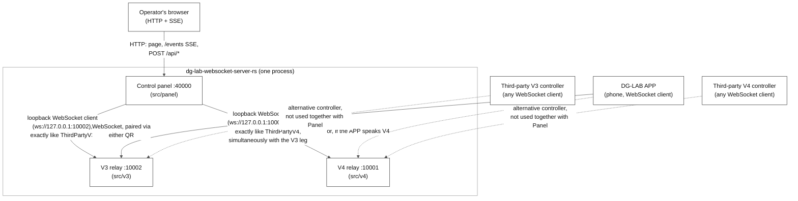
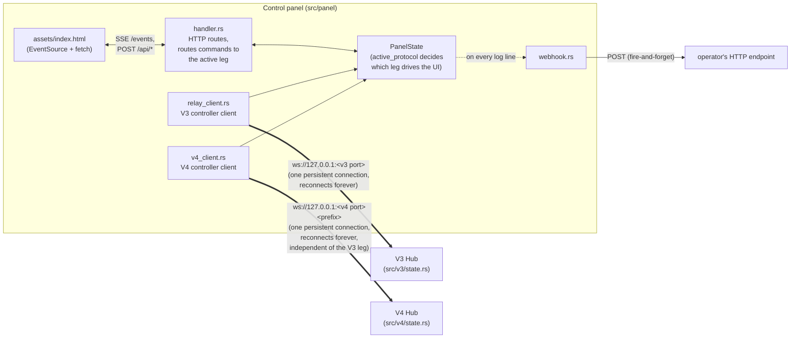

# Architecture

## Overview

This binary runs three independent Axum web servers concurrently in one
process, sharing no in-process state:

| Server | Default port | Protocol | Role |
| --- | --- | --- | --- |
| V3 relay | `10002` | WebSocket, path/query-based pairing | 1 controller : 1 device relay — strength adjust, clear, pulse waveforms |
| V4 relay | `10001` | WebSocket, `?targetId=`/`?tid=` pairing under a configurable path prefix | 1 controller : N devices relay — opaque `data` passthrough |
| Control panel | `40000` | HTTP + SSE | Human-facing webpage that drives a device *through* the V3 and V4 relays, at once |

`src/main.rs` spawns all three as independent tokio tasks and fails the
whole process (`try_join!`) if any one of them fails to bind — normally
because a port is already taken.



## Why the panel doesn't share the V3 and V4 Hubs' in-process state

The panel is architecturally just another controller, on both protocols at
once. `src/panel/relay_client.rs` opens a `tokio-tungstenite` WebSocket to
`ws://127.0.0.1:<v3 port>`, and `src/panel/v4_client.rs` independently opens
one to `ws://127.0.0.1:<v4 port><prefix>` — the same loopback connections any
real third-party controller would make — rather than reaching into
`v3::state::Hub`/`v4::state::Hub` directly. This was a deliberate choice:

- It reuses the already-tested V3 and V4 relays completely unchanged; the
  panel adds zero special-casing to either protocol's pairing/message logic.
- It proves each relay's own wire protocol end-to-end on every panel
  interaction (if the panel works, a real third-party controller integrating
  against the same protocol will too).
- It keeps the concerns decoupled: neither relay knows anything about panels,
  webhooks, or upper limits — those all live entirely in `src/panel`.

The trade-off is that the panel is *a* controller on each protocol, not *the*
controller — running a separate third-party controller against the same
protocol at the same time as the panel is not a supported configuration (V3
is strictly 1-controller:1-device; V4 devices attach to whichever controller
they're given a `targetId`/`tid` for, so a third-party V4 controller just
wouldn't see the panel's devices, and vice versa). Running V3 and V4
*simultaneously* through the panel itself, on the other hand, is the normal
supported case — see [state ownership](#state-ownership) below and
`src/panel/state.rs`'s module docs for how the two are reconciled into one
set of shared controls.

## Module layout

```
src/
├── main.rs        — spawns all three servers, fails fast if any can't bind
├── lib.rs          — crate root, re-exports v3/v4/panel/env/logging modules
├── env.rs          — typed env-var readers (u16/u64/i64 from env, with defaults)
├── logging/
│   ├── mod.rs       — leveled stdout+file logging shared by all three servers
│   └── (backed by flexi_logger for size-capped rotating file output)
├── v3/
│   ├── mod.rs       — build()/serve()/serve_with() — construct Hub+Router
│   ├── config.rs    — env-driven Config (PORT, HEARTBEAT_INTERVAL, ...)
│   ├── protocol.rs  — wire-frame parsing/validation/normalization
│   ├── pulse.rs      — pulse-waveform packetization
│   ├── state.rs      — Hub: pairing table, per-connection senders, pulse timers
│   ├── handler.rs    — connection lifecycle + message routing (the protocol itself)
│   └── heartbeat.rs  — periodic {"type":"heartbeat"} broadcast
├── v4/
│   ├── mod.rs, config.rs, state.rs, handler.rs  — mirrors v3's split
│   ├── idle.rs       — zero-devices idle timeout for a controller
│   └── ping.rs       — native WS ping / missed-pong termination
└── panel/
    ├── mod.rs         — build()/serve() — construct PanelState+Router, spawn relay_client + v4_client
    ├── config.rs      — env-driven Config (PANEL_PORT, PANEL_PUBLIC_WS_BASE, PANEL_WEBHOOK_URL)
    ├── state.rs        — PanelState: V3+V4 connection status/ids, active-leg logic, feedback, log
    ├── relay_client.rs — the panel's own V3 controller client + reconnect loop
    ├── v4_client.rs      — the panel's own V4 controller client + reconnect loop
    ├── commands.rs      — builds real V3 wire frames (strength/clear/pulse) for the panel to send
    ├── v4_commands.rs     — builds real V4 device.op/device.op.clear RPC frames
    ├── presets.rs        — 44 verified dglab-kit waveform presets for the UI picker (used by both protocols)
    ├── qrcode.rs          — pairing URLs + DG-LAB deep links (V3 and V4 schemes) + inline SVG QR rendering
    ├── network.rs          — LAN IP autodetection for QR pairing over WiFi
    ├── webhook.rs           — outbound HTTP POST notification delivery
    ├── assets.rs             — rust-embed struct + a serve(path) helper handler.rs calls
    ├── handler.rs            — HTTP routes: page, /assets/*, /events SSE, POST /api/* (routes to whichever leg is active)
    └── assets/                — the frontend as plain files, embedded into the binary (see below)
        ├── index.html
        ├── style.css
        └── app.js
```

**The frontend build step is "there is none."** `index.html`/`style.css`/`app.js`
are hand-written, dependency-free files — no bundler, no npm, no build
step — embedded into the compiled binary via [`rust-embed`](https://docs.rs/rust-embed)
(`src/panel/assets.rs`) so the shipped artifact stays a single
self-contained executable with nothing to deploy alongside it. In debug
builds `rust-embed` reads the files live from disk on every request
(the `debug-embed` feature is deliberately left off), so editing the
frontend during development doesn't require a rebuild between changes;
release builds compile the bytes directly into the binary, verified by
running the release binary from an unrelated working directory with no
`src/` tree present and confirming the page still serves correctly.

## State ownership

Each server owns exactly one piece of shared state, guarded by a single
`std::sync::Mutex` (never held across an `.await`), following the same
pattern in all three:

- **V3 `Hub`** (`v3::state::Hub`) — the pairing table (`clientId` ↔
  `targetId`), each connection's outbound `mpsc::UnboundedSender`, and
  per-channel pulse-timer cancellation tokens.
- **V4 `Hub`** (`v4::state::Hub`) — the controller↔device attachment table,
  each connection's sender, and idle/ping bookkeeping.
- **`PanelState`** (`panel::state::PanelState`) — the panel's view of both its
  own connections: V3 and V4 status/controller/device ids tracked
  independently, plus which one is currently `active_protocol` (whichever
  paired most recently — see its module docs for the exact rules); the
  active leg's last-known device strength/soft-limit/button-feedback;
  operator-configured upper limits and webhook URL (protocol-agnostic); and
  a capped 200-line log ring buffer. A `tokio::sync::broadcast::Sender<()>`
  fires on every change; `/events` (SSE) and the webhook delivery path both
  key off it.

## Concurrency model

- Every WebSocket connection (V3, V4, and the panel's own two client
  connections to each) uses the same split-sender pattern: the socket is
  split into a reader half (owned by the connection's main select loop) and
  a writer half moved into its own `tokio::spawn`'d task fed by an
  `mpsc::unbounded_channel`. This lets any other task (the pairing partner,
  the heartbeat broadcaster, an idle timer) push a frame to a connection
  without owning the socket itself — it just holds a clone of that
  connection's `mpsc::UnboundedSender`.
- Idle timeouts (V3 unpaired connections, V4 zero-device controllers), the
  V3 pulse-replace delay, and the panel's on-demand reconnect (independently
  for each leg — `reconnect_token`/`v4_reconnect_token`) all use
  `tokio_util::sync::CancellationToken`, `select!`'d against a `sleep` —
  cancelling the token short-circuits the wait immediately instead of
  waiting out the full timeout.
- The webhook POST (`panel::webhook::notify`) is fire-and-forget:
  `tokio::spawn`'d with its own 5s timeout, never awaited by the caller, so a
  slow or unreachable webhook endpoint can never block the panel's own
  event loop, SSE stream, or V3 relay traffic.

## Data flow: what "the panel" actually is


