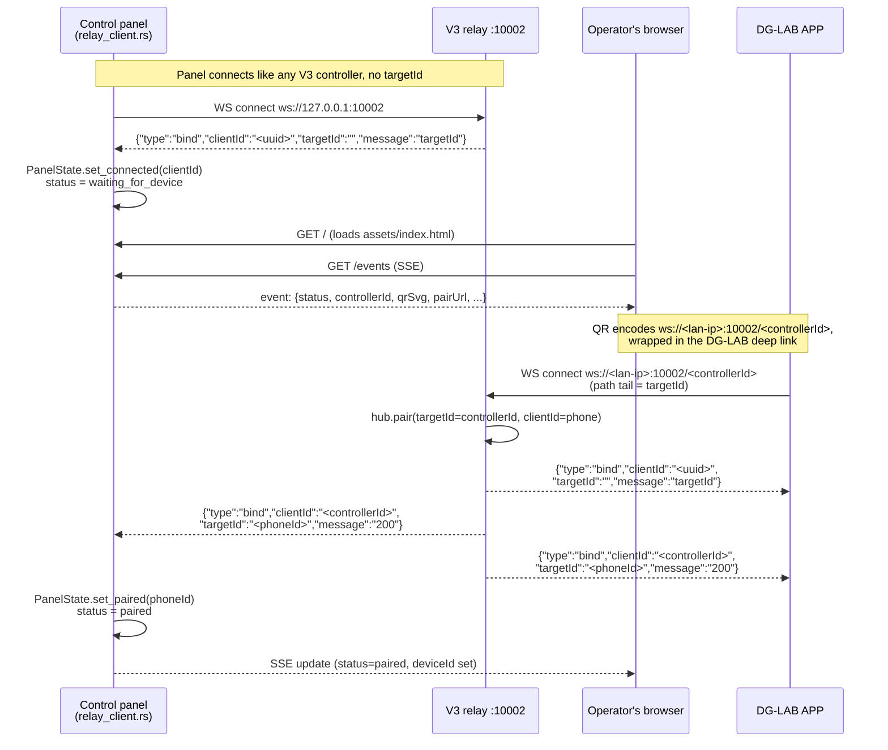
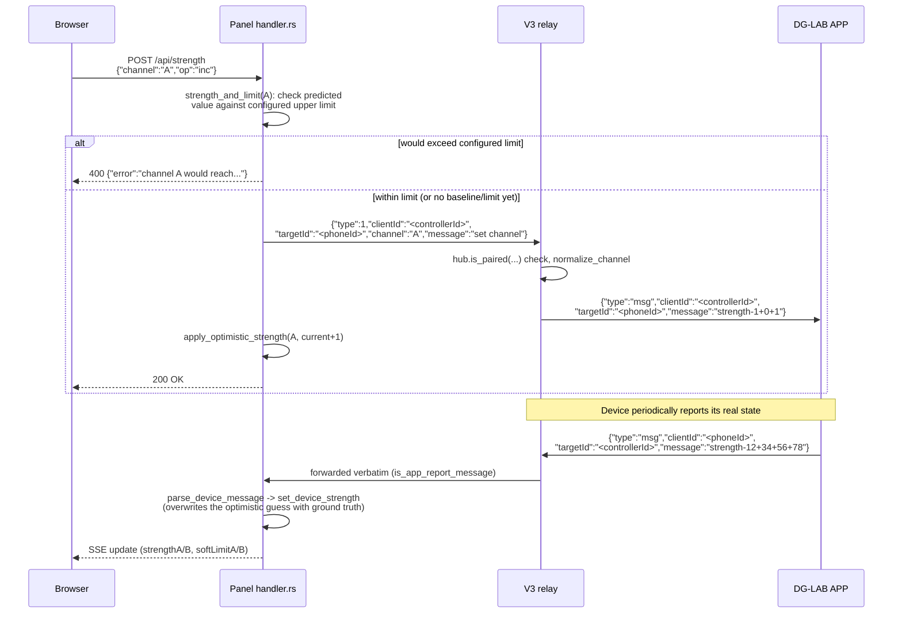
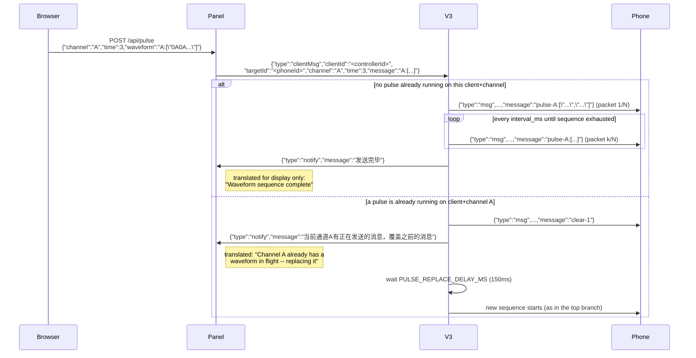
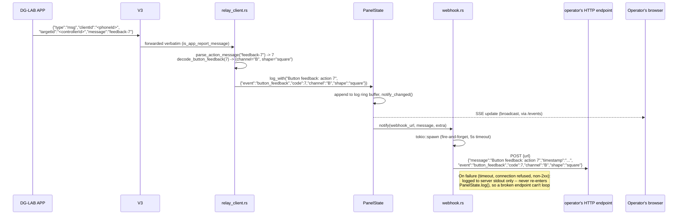
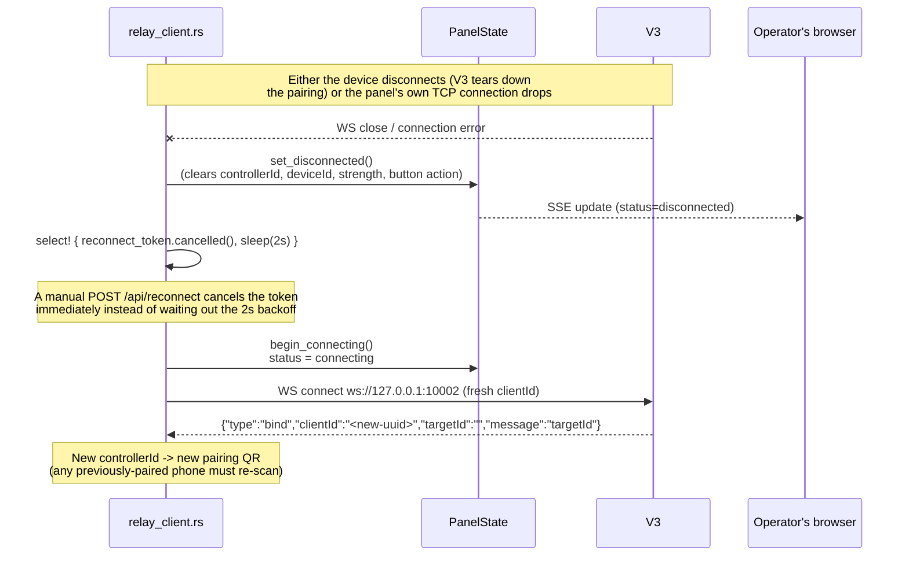
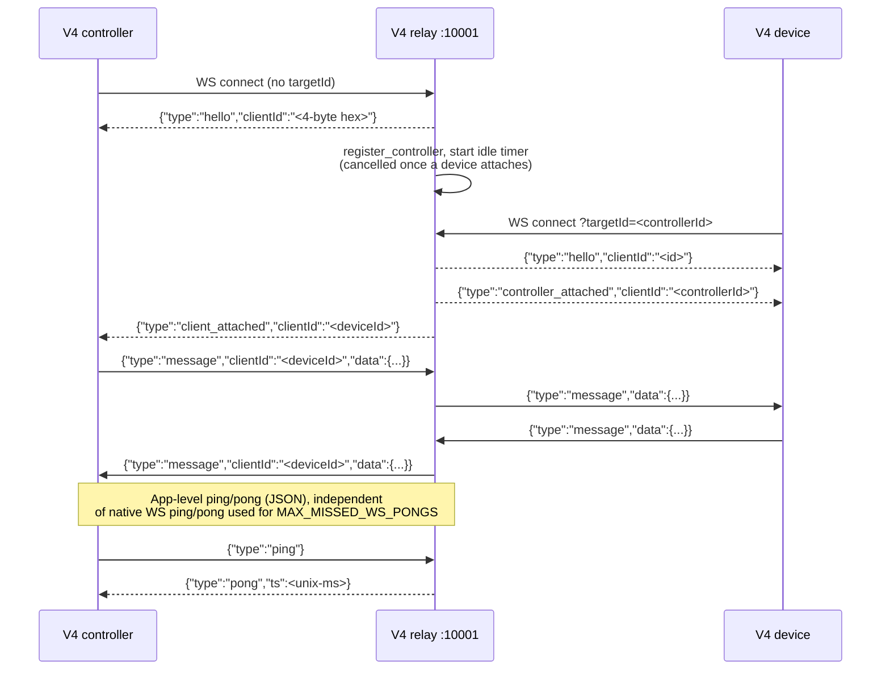

# Sequence diagrams

These trace the exact message shapes exchanged on the wire (field names/types
verbatim from `src/v3/handler.rs`, `src/v3/protocol.rs`, `src/v4/handler.rs`),
not simplified summaries.

## 1. Panel startup and pairing (V3, via the control panel)

The panel is architecturally just another controller, on both protocols at
once — see
[architecture.md](architecture.md#why-the-panel-doesnt-share-the-v3-and-v4-hubs-in-process-state).
This trace covers its V3 leg; see [diagram 7](#7-panel-startup-and-pairing-v4-via-the-control-panel)
for the equivalent V4 leg, which runs independently and simultaneously.



## 2. Strength command (increase / decrease / set)



`type` 1/2/3 = increase/decrease/set (message `"strength-<channel>+<sendType>+<value>"`,
`sendType = type - 1`); `type` 4 with `message` containing `"clear"` clears a
channel and the app is notified with a Chinese `notify` frame (kept
byte-for-byte faithful to the reference spec — see
[api.md](api.md#wire-fidelity-note-two-chinese-strings)); a `time`/`strength`
outside those numeric types goes through `type` 3's "custom strength"
handling instead.

## 3. Pulse waveform (with an in-flight replacement)



## 4. Physical button press → webhook



The channel/shape mapping is empirically determined, not from any official
spec — see the doc comment on `decode_button_feedback` in
`src/panel/relay_client.rs` and
[api.md — Device feedback](api.md#device-feedback-device--controller) for the
full table and how it was derived.

## 5. Relay disconnect and reconnect



## 6. V4 relay (bare wire protocol — 1 controller : N devices, opaque payloads)

This trace shows the raw relay-level protocol, treating `data` as opaque
(which is all the relay itself ever does). For what a real DG-LAB 4
APP/controller actually puts inside `data` — and how the control panel
uses it — see [diagram 7](#7-panel-startup-and-pairing-v4-via-the-control-panel)
and [api.md's `data` schema section](api.md#the-data-schema-real-dg-lab-4-apps-use).



## 7. Panel startup and pairing (V4, via the control panel)

Runs independently and simultaneously with [diagram 1](#1-panel-startup-and-pairing-v3-via-the-control-panel)'s
V3 leg — the panel maintains both connections at once. `data` payloads here
follow the RPC schema `dglab-kit` documents for the real DG-LAB 4 APP (see
[api.md](api.md#the-data-schema-real-dg-lab-4-apps-use)), which is what the
panel implements in `src/panel/v4_commands.rs`/`v4_client.rs` — this is not
the bare opaque-`data` relay trace from diagram 6.

```mermaid
sequenceDiagram
    participant Panel as Control panel<br/>(v4_client.rs)
    participant V4 as V4 relay :10001
    participant App as DG-LAB 4 APP
    participant Browser as Operator's browser

    Panel->>V4: WS connect ws://127.0.0.1:10001&lt;prefix&gt;
    V4-->>Panel: {"type":"hello","clientId":"&lt;8-hex-char id&gt;"}
    Panel->>Panel: PanelState.v4_set_connected(clientId)<br/>v4_status = waiting_for_device

    Note over Panel,App: V4's QR/deep link encodes<br/>ws://&lt;lan-ip&gt;:10001&lt;prefix&gt;/?tid=&lt;v4 controller id&gt;
    App->>V4: WS connect ?tid=&lt;v4 controller id&gt;
    V4-->>App: {"type":"hello","clientId":"&lt;appId&gt;"}
    V4-->>App: {"type":"controller_attached","clientId":"&lt;v4 controller id&gt;"}
    V4-->>Panel: {"type":"client_attached","clientId":"&lt;appId&gt;"}
    Panel->>Panel: v4_set_app_attached(appId)

    App->>V4: {"type":"message","data":{"t":"ev","ev":"devices.snapshot",<br/>"devices":[{"slotId":"slot1","name":"Coyote","type":"COYOTE_030",<br/>"props":{"intensityA":0,"intensityB":0}}]}}
    V4-->>Panel: {"type":"message","clientId":"&lt;appId&gt;","data":{...}}
    Panel->>Panel: v4_set_device(slot1, "Coyote", 0, 0)<br/>v4_status = paired, active_protocol = V4
    Panel-->>Browser: SSE update (v4Status=paired,<br/>activeProtocol="v4", strengthA/B populated)

    Note over Browser,App: Operator clicks "+" on channel A
    Browser->>Panel: POST /api/strength {"channel":"A","op":"inc"}
    Panel->>V4: {"type":"message","clientId":"&lt;appId&gt;","data":{"t":"req","reqId":"1",<br/>"m":"device.op","data":{"s":"slot1","t":3,"c":0,"p":1,"v":1}}}
    V4->>App: {"type":"message","data":{"t":"req","reqId":"1",<br/>"m":"device.op","data":{"s":"slot1","t":3,"c":0,"p":1,"v":1}}}
    Note right of V4: The relay strips the outer clientId when<br/>forwarding controller -> device (a device only<br/>ever has one controller, so it isn't needed)
    Panel->>Panel: apply_optimistic_strength(A, 1)
    Panel-->>Browser: 200 OK

    Note over App,Panel: On-screen button tap
    App->>V4: {"type":"message","data":{"t":"ev","ev":"custom.action","action":2}}
    V4-->>Panel: {"type":"message","clientId":"&lt;appId&gt;","data":{...}}
    Panel->>Panel: decode_button_feedback(2) -> (A, square)<br/>set_button_action(V4, 2)

    Note over App,Panel: APP disconnects
    App--xV4: WS close
    V4-->>Panel: {"type":"client_disconnected","clientId":"&lt;appId&gt;"}
    Panel->>Panel: v4_clear_device()<br/>active_protocol falls back to V3 if still paired, else None
```
